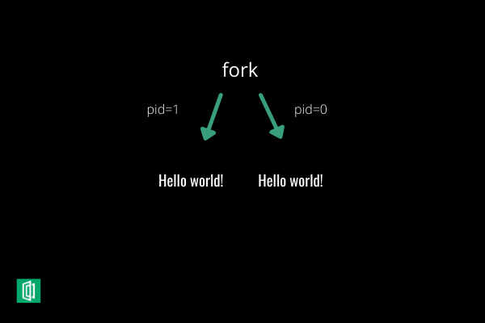

# **Futex**


---

#### **O que e Futex?**
No contexto da computacao, "Fast User-Space Mutex" ou Futex e uma chamada de sistema que promove um metodo de espera (wait), ou seja, faz com que um processo ou uma thread aguarde ate que uma condicao seja satisfeita. Futex, tambem, pode despertar (wake) um processo ou thread que esteja aguardando.

---
#### **Para que foi desenvolvido?**
Muitas vezes, processos ou threads precisam acessar uma mesma regiao de memoria para modificar seus dados, porem, o acesso simultaneo pode ocasionar inconsistencias no proprama. O exclusao mutua (Mutex) foi uma solucao encontrada para solucionar esse problema, porem, para isso mutex se baseava em empera ocupada tornando seu uso despendioso. O futex foi desenvolvido para tornar o mutex mais rapido e barato.

---

#### **Onde se usa Futex?**
Futex e utilizado tipicamente para implementar locks, semaforos, barreiras, mutexes ou variaveis de condicao. Essas implementacoes sao mais intuitivas e, portanto, sao mais simples de serem usadas pelo usuario final que o futex diretamente.

---
#### **Implementacao**
Um futex e um valor inteiro de 32-bits fornecido para a chamada de sistema futex(). Todas as operacoes de futex sao geridas por esse valor que e compartilhado por todos os processos, ou seja, um processo pode ter um endereco virtual diferente mas a regiao de memoria fisica tem que ser a mesma. Se futex e chamado, ele verifica seu valor para determinar se o processo vai seguir ou esperar.

---
#### **Parametros**
int futex(int *uaddr, int op, int val, const struct timespec *timeout,int *uaddr2, int val3);
1. Endereco futex
2. Operacao
3. Depende da operacao
4. Tempo de saida (opicional)
5. Depende da operacao
6. Depende da operacao

---
#### **FUTEX_WAIT**
Futex oferece uma grande quantidade de operacoes. Vamos tratar aqui das duas operacoes mais basicas futex_wait e futex_wake. Para futex_wait, o parametro val tem o valor *uaddr. Quando futex e chamado com futex_wait ele checa atomicamente se *uaddr == val e se for igual ele coloca a thread para dormir. Caso contrario ela sai do futex.
 
---
####  **FUTEX_WAKE**
Futex_wake acorda um processo se houver algum processo dormindo. Obs. Nesse contexto podemos entender threads e processos como sinonimos.

---
#### **Exemplo**
Vamos usar um codigo simples para ilustrar o uso de futex().
Primeiro vamos criar uma API para implementar semaforos com futex.

---
##### simple_futex.h
```C
#ifdef __cplusplus
extern "C" {
#endif
struct simplefu_semaphore {
int avail;
int waiters;
};
typedef struct simplefu_semaphore *simplefu;
void simplefu_down(simplefu who);
void simplefu_up(simplefu who)
#ifdef __cplusplus
}
#endif
```
---
Nossa implementacao consiste em duas simples operacoes, simplefu_down e simplefu_up, que sao equivalentes a 
sem_wait() e sem_post(). A struct tem duas variaveis. A primeira, **avail**, e o contador de semaforos e a segunda, **waiters** e usada para sabermos se precisamos despertar algum processo.

---
##### simple_futex.c
```C
#include "simple_futex.h"
#include <linux/futex.h>
#include <unistd.h>
#include <sys/syscall.h>
#include <stdio.h>

void simplefu_down(simplefu who)
{
    int val;
    do {
        val = who->avail;
        if( val > 0 && __sync_bool_compare_and_swap(&who->avail, val, val - 1) )
        return;
        __sync_fetch_and_add(&who->waiters, 1);
        syscall(__NR_futex, &who->avail, FUTEX_WAIT, val, NULL, 0, 0);
        __sync_fetch_and_sub(&who->waiters, 1);
    } while(1);
}
```
---
```C
void simplefu_up(simplefu who)
{
    int nval = __sync_add_and_fetch(&who->avail, 1);
    if( who->waiters > 0 )
    {
        syscall(__NR_futex, &who->avail, FUTEX_WAKE, nval, NULL, 0, 0);
    }
}
```
---
##### **main.c**
```C
#include <stdio.h>
#include <sys/types.h>
#include <sys/stat.h>
#include <fcntl.h>
#include <sys/mman.h>
#include <stdlib.h>
#include <assert.h>
#include "simple_futex.h"
int main() {
    int lockfile = open("ipc_lock", O_RDWR);
    assert(lockfile != -1);
    simplefu sema = mmap(NULL, sizeof(*sema), PROT_READ|PROT_WRITE, MAP_SHARED, lockfile, 0);
    assert(sema != MAP_FAILED);
    int pid = fork();
    assert(pid != -1);
```
---
```C
if( pid == 0 ) { // child
    printf("Initializing...\n");
    sleep(10);
    printf("Done initializing\n");
    simplefu_up(sema);
    exit(0);
}
printf("Waiting for child...\n");
simplefu_down(sema);
printf("Child done initializing\n");
return 0;
}
```

---
ipc_lock e um simples arquivo de 8 byte (A plataforma especifica o tamanho de *sema) preechido com zeros. Para gerar esse arquivo digite no terminal ```dd if=/dev/zero of=ipc_lock bs=8 count=1```.

---
Observe que usamos o fork() para criar um processo filho.


---
#### **Saida**
% ./a.out
Waiting for child...
Initializing...
Done initializing
Child done initializing

---
A parte 'fast' e 'user-space' do futex vem do fato de, em muitos casos, nao haver necessidade de se fazer chamadas de sistema, pois nao ha contencao de processos.

---
Vamos fazer algumas alteracoes para entender melhor
```C
if( pid == 0 ) { // child
    printf("Initializing...\n");
    sleep(10);
    simplefu_up(sema);
    sleep(1);
    printf("Done initializing\n");
    exit(0);
}
sleep(5);
printf("Waiting for child...\n");
simplefu_down(sema);
printf("Child done initializing\n");
return 0;
}
```
---
##### **Saida**
Initializing...
Waiting for child...
Child done initializing
Done initializing

---
Obeserve que nesse ultimo exemplo o processo pai inicializa e aguarda o filho inicializar. Isso sera feito apos o processo pai despertar o filho.

---
#### **Referencias**
[https://man7.org/linux/man-pages/man2/futex.2.html](https://man7.org/linux/man-pages/man2/futex.2.html).
[https://man7.org/linux/man-pages/man7/futex.7.html](https://man7.org/linux/man-pages/man7/futex.7.html)
[http://meta-meta.blogspot.com/2010/11/linux-threading-primitives-futex.html](http://meta-meta.blogspot.com/2010/11/linux-threading-primitives-futex.html)
[https://www.remlab.net/op/futex-condvar.shtml](https://www.remlab.net/op/futex-condvar.shtml)
[https://www.ic.unicamp.br/~islene/2s2013-mo806/futex/futex-are-tricky.pdf](https://www.ic.unicamp.br/~islene/2s2013-mo806/futex/futex-are-tricky.pdf)
[https://www.section.io/engineering-education/fork-in-c-programming-language/](https://www.section.io/engineering-education/fork-in-c-programming-language/)
[https://en.wikipedia.org/wiki/Futex](https://en.wikipedia.org/wiki/Futex)

---


---
#### **Trabalho 3 MC504 1s2021**
David Afonso Borges dos Santos		RA: 261032
Lucas Alves Martins					RA: 158144
Saymon Felipe Fernandes Dos Anjos	RA: 244277

